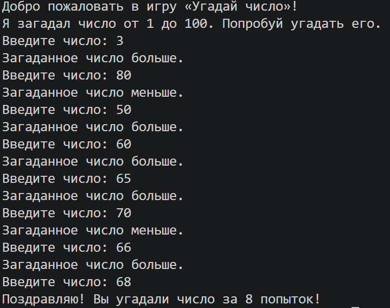

цель: научиться взаимодействовать с библиотекой random и создать мини игру угадай число

установка: библиоте random - стандартная, по этому устанавливать ничего не треуется

команда запуска: python number.py

пример работы: 

функции: загадывание и отгадывание чисел

подробнее о проекте: PORTFOLIO.md

